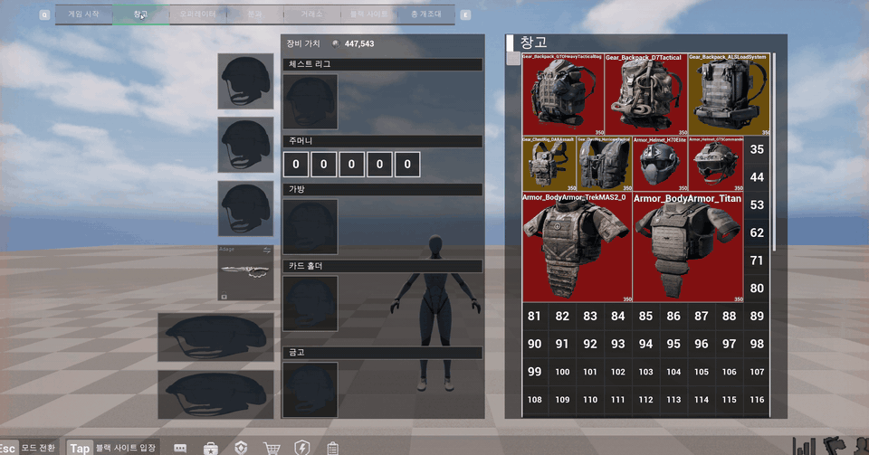
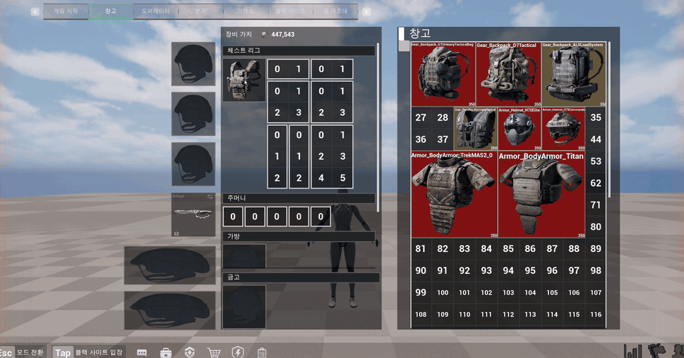
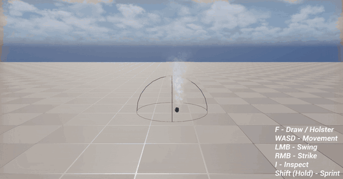

# NULL POINT · 포트폴리오 자료

**포트폴리오 페이지 (노션): https://respected-colt-9e4.notion.site/NULL-POINT-3f506cd2776681669383d78cec1e8530**

이 브랜치는 포트폴리오용 자료만 담고 있습니다. 프로젝트 소스는 [`master` 브랜치](https://github.com/immigration2000/ExtractionGame_Fin/tree/master)에 있습니다.

델타 포스를 레퍼런스로, 장비마다 칸 배치가 다른 그리드 인벤토리와 로비 → 레이드 → 탈출 루프를 Unreal Engine 5.8 블루프린트로 구현한 개인 프로젝트 (2026.09.10 ~ 10.05).

| 자료 | 파일 |
|---|---|
| 발표 자료 (PDF, 브라우저에서 보기) | [NULL_POINT_presentation.pdf](NULL_POINT_presentation.pdf) |
| 발표 자료 원본 (PowerPoint, GIF 재생 · 발표자 노트 포함) | [NULL_POINT_presentation.pptx](NULL_POINT_presentation.pptx) |
| 플레이 화면 | [media/](media) |

## 플레이 화면

장비 칸에 체스트 리그를 놓으면 조끼 칸 배치가 그려짐

창고 안에서 아이템 드래그 앤 드롭

탈출 구역 10초 카운트다운 → 로비 복귀

